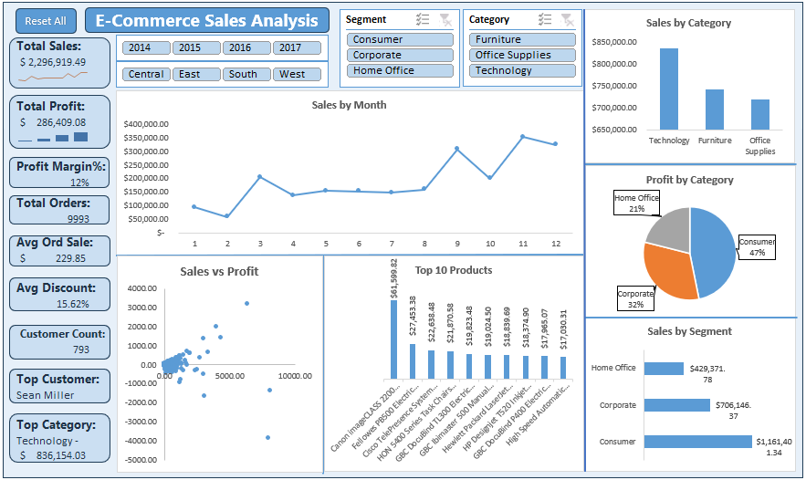

## E-Commerce Sales Analysis Dashboard (Excel)
This project contains an interactive Excel dashboard built using the Sample Superstore dataset.
The dashboard provides a comprehensive view of e-commerce performance across sales, profit, categories, segments, and customer behavior.

### Project Overview
The goal of this project is to analyze e-commerce sales data and provide meaningful business insights through an interactive dashboard.
It enables users to understand trends, identify profitable segments, evaluate category performance, and explore customer-level metrics.

#### Files Included
Sample_Superstore_project.xlsx -> The main Excel dashboard file & data

#### Tools & Features Used
* Microsoft Excel
* Power Query (for data cleaning & transformation)
* Pivot Tables
* Slicers
* Interactive Charts
* Formulas & KPI calculations

#### Key Performance Indicators (KPIs)
**The dashboard displays**:
* Total Sales
* Total Profit
* Profit Margin%
* Total Orders
* Avg Ord Sale
* Avg Discount
* Customer Count
* Top Customer
* Top Category

#### Interactive Slicers
Users can filter the entire dashboard by:
Year, Region, Segment, Category

#### Dashboard Visuals
**Monthly Sales Trend (Line Chart)**
Shows seasonality and monthly fluctuations in sales.

**Sales vs Profit (Scatter Plot)**
Highlights the relationship between sales and profitability.

**Top 10 Products (Column Chart)**
Displays highest-performing products based on sales.

**Sales by Category (Column Chart)**
Shows contribution of each category to total sales.

**Profit by Category (Pie Chart)**
Visualizes distribution of total profit across categories.

**Sales by Segment (Bar Chart)**
Compares sales performance across Customer Segments.

**Reset Button**
Quickly clears all slicer selections for easy analysis.

#### Data Preparation
Data was cleaned and transformed using:
**Power Query** -
* Removed duplicates
* Standardized date formats
* Corrected data types
* Added columns for Year, Month, YearMonth
* Loaded into Pivot Tables for analysis

#### Key Insights
Some examples of insights the dashboard can provide:
* Seasonal sales patterns and top-performing months
* High-profit vs low-profit product categories
* Segments that generate the most revenue
* Customer-level contribution to total sales
* Profitability trends across regions

#### How to Use
* Download the Excel file.
* Open Sample_Superstore_project.xlsx
* Use slicers to filter:
** Region
** Year
** Segment
** Category
* Review KPIs and charts to explore insights.
